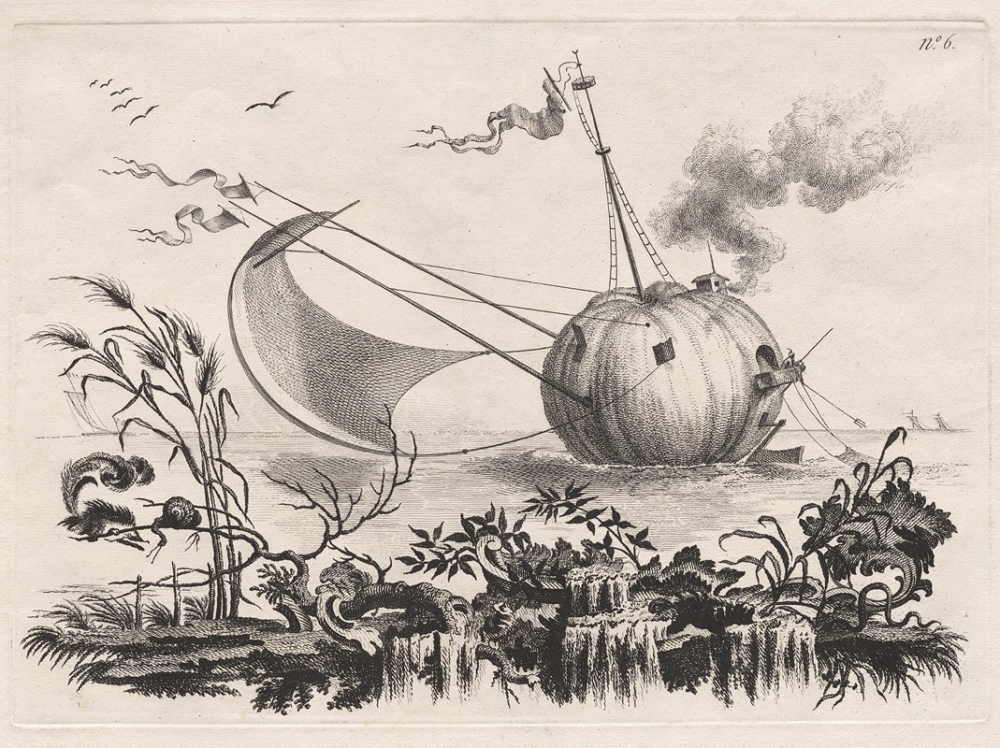

# Models Gallery

  

    <a href="./model1.html">
      
      <h3>A Pumpkin Used as a Fishing Boat (1769)</h3>
    </a>
  

  

    <a href="./model2.html">
      
      <h3>A House on Water, and a New Way to Summon Geese by the Beat of a Drum (1769)</h3>
    </a>
  

  

    <a href="./model3.html">
      
      <h3>Pumpkins Used as Dwellings to Be Secure against Wild Beasts (1769)</h3>
    </a>
  

