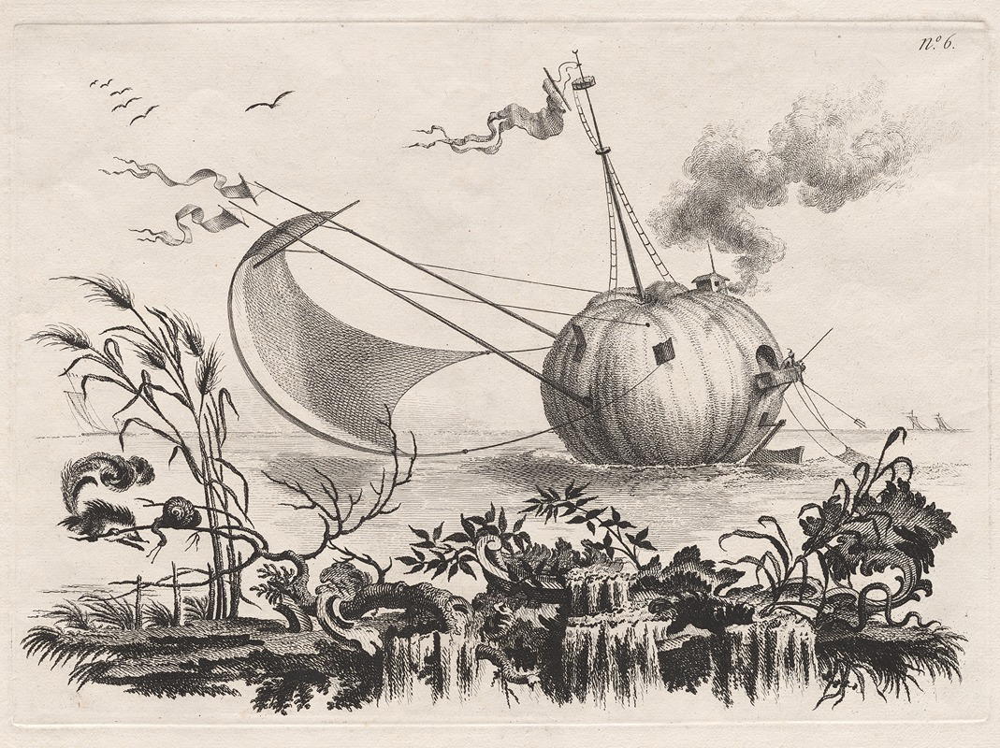

# Model 1: Pumpkin Boat

<canvas id="modelCanvas"></canvas>

## Inspiration

*Image Source: [A Pumpkin Used as a Fishing Boat](https://artvee.com/dl/a-pumpkin-used-as-a-fishing-boat/)*

## Credits

- **Artist:** Unknown
- **Source:** [Artvee](https://artvee.com)

## Description

An animated 3D model inspired by a whimsical artwork depicting a pumpkin used as a fishing boat.

<audio controls>
  <source src="../../assets/model1-audio.mp3" type="audio/mpeg">
  Your browser does not support the audio element.
</audio>
